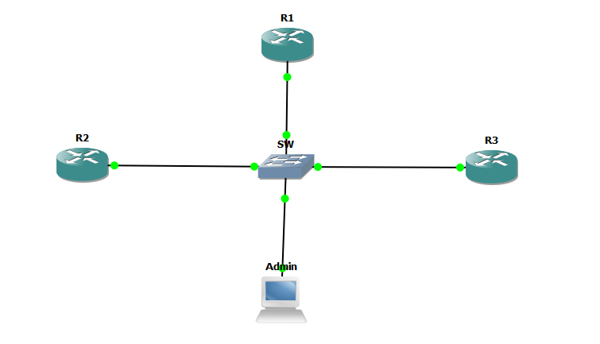
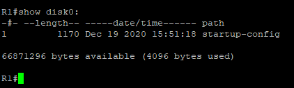
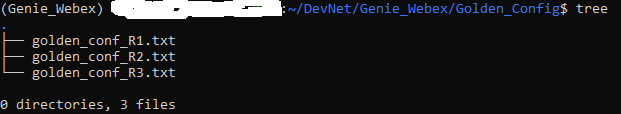
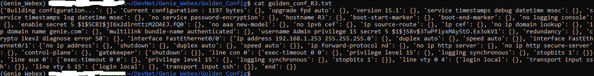
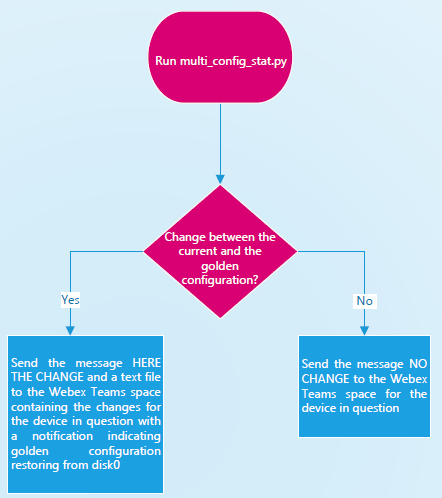
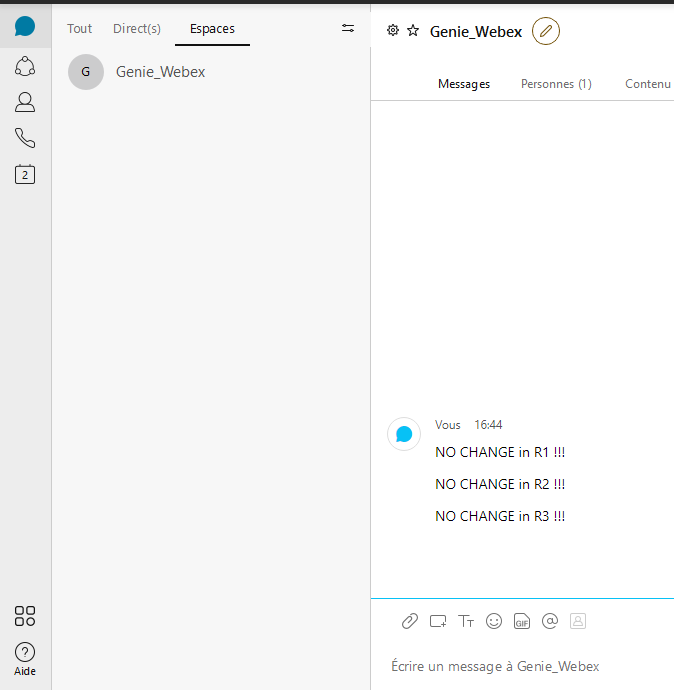
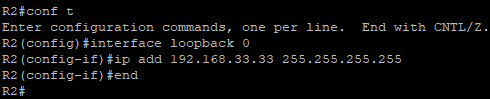
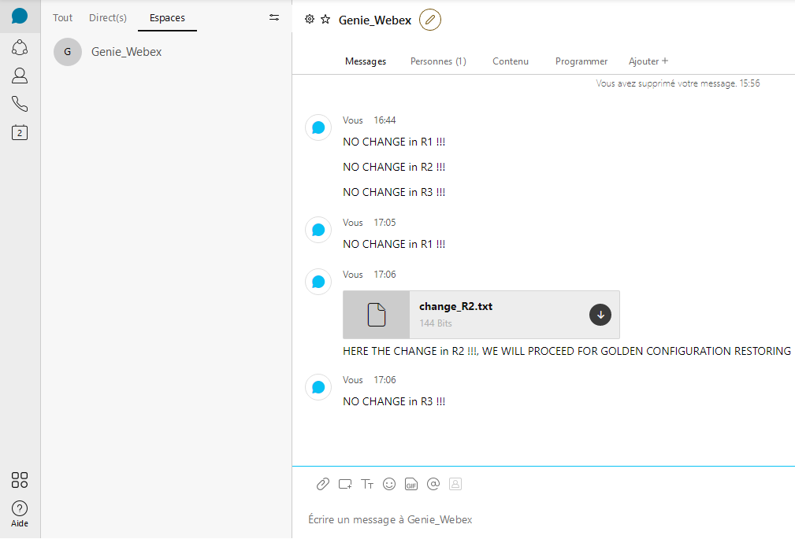
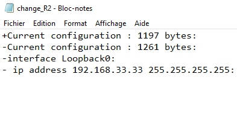
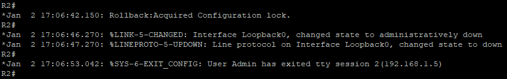

# Genie_Webex Project

This project combines two Cisco solution : Webex Teams and Genie/pyATS.
The goal is to check the state of the routers if there is any change in the desired configuration.
Cisco Webex Teams is used to receive alerts for the result: Configuration change or not. Genie/pyATS is used to test and compare the configuration with its functions and APIs.
Here are the links for more information about Webex Teams and Genie/pyATS:

Webex Teams : 

https://www.webex.com/team-collaboration.html 

and to use the Webex APIs : 

https://developer.webex.com/ 

To get started with Genie/pyATS : 

https://pubhub.devnetcloud.com/media/genie-docs/docs/cookbooks/index.html 

# Topology and Simulation
Here is the topology used to test this project:

GNS3 was used with Cisco routers equipped with IOS images and a Linux machine as admin since the framework Genie/PyATS works only on Linux or Mac OSX. However, you can use the Windows Subsystem for Linux (WSL, as the case used in this project). This allows to test the project even if we do not have recent versions of GNS3 or EVE-NG with IOS-XE which consumes resources (RAM and CPU). However, you can test this project using your own emulator or the DevNet SANDBOX Cisco Modeling Labs (CML). You just need to modify the parameters concerning the information about the devices used in the _connex.yml_ file (IP addresses, users, IOS type, ...). Here is the link for the SANDBOX catalogs, just choose the one from Cisco Modeling Labs : https://devnetsandbox.cisco.com/RM/Topology.

# Packages installation and Requierements

All the packages used are found in requirements.txt. But you can install the packages as follows : 

pip3 install pyats[full]

pip3 install requests

pip3 install requests-toolbelt

### Note : 

You must create a Webex Teams Space in order to test this project. Please refer to https://developer.webex.com/ to learn more how to use APIs to create Spaces and manage messages.

# How to use the project
## Note : 
You must create the __Golden_Config__ file before running _multi_golden_config.py_ script in order to save the golden configuration in the desired configuration state of the devices.
If you use the golden configuration files provided for each router used in this project(Refer to __Golden_Config___ folder), you need to create RSA Keys to enable SSH. The credentials used could be found in _connex.yml_ file. 

Feel free to change the parameters in _connex.yml_ file  according to your devices configuration and types (os, ip, credentials,...)

In _multi_config_stat.py_, I used _Disk0_ to store the startup-config (golden configuration in desired state), you must change it according to your device configuration. To save it, use the command : _copy running-config disk0:startup-config_. The following figure shows the content of Disk0 for R1 router:

Please update the _access_token_ and  _room_id_ in _multi_config_stat.py_ according to your setting in Webex Teams.

Before running the test, please ensure that you run the _multi_golden_config.py_ script in order to ensure the golden configuration (Desired configuration) in the folder _Golden_Config_ for comparing purposes.

The configuration is saved as string dictionary as indicated in the following figure.

# Test and Results

Here the flowchart of the project scenario : 

## Scenario in case no change

Here we run the script

__python3 multi_config_stat.py__

Here the result in __Genie_Webex__ space

## Scenario in case of change

In this case a loopback interface is configured in R2 as follows : 

Then we run the script again:

__python3 multi_config_stat.py__

Here the result sended to Webex Teams space:

Here the content of the file _change_R2.txt_

The golden configuration restoring process is applied as indicated in the following figure:

# About me
I am a PhD in Electronics and a Cisco Certified Academic Instructor for more than 5 years. I am interesting in all about NetDevOps, Networking programmability and automation. I am a Cisco contents fan. You can contact me on [LinkedIn](https://www.linkedin.com/in/mehdi-cherifi-4b5a641b3?lipi=urn%3Ali%3Apage%3Ad_flagship3_profile_view_base_contact_details%3Bu%2FhQw71bTDKuT%2BljXLLFyA%3D%3D), [Twitter](https://twitter.com/LocketKeepsake) or [GitHub](https://github.com/cherifimehdi)
